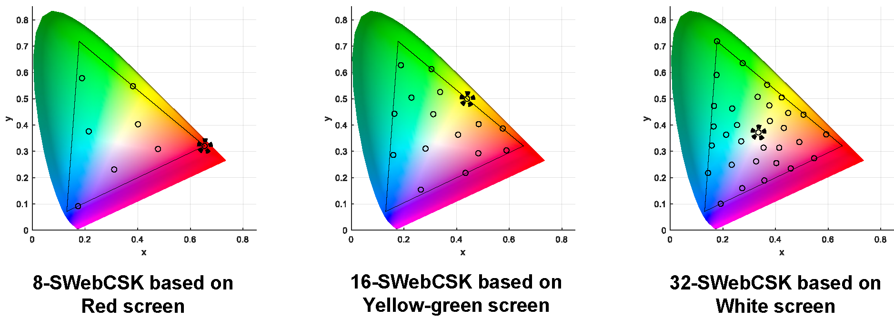

<h1 align="center"> SpiderWeb: Enabling Through-Screen Visible Light Communication</h1>

This repository is the official implementation of "[SpiderWeb: Enabling Through-Screen Visible Light Communication](https://doi.org/10.1145/3485730.3485948)"
in the ACM Conference on Embedded Networked Sensor Systems (SenSys) 2021 


## Introduction
We are now witnessing a trend of realizing full-screen on electronic devices such as smartphones to maximize their screen-to-body ratio for a better user experience. Thus the bezel/narrow-bezel on today's devices to host various line-of-sight sensors would disappear. This trend not only is forcing sensors like the front cameras to be placed under the screen of devices, but also will challenge the deployment of the emerging Visible Light Communication (VLC) technology, a paradigm for the next-generation wireless communication. In this work, we propose the concept of through-screen VLC with photosensors placed under Organic Light-Emitting Diode (OLED) screen. Though being transparent, an OLED screen greatly attenuates the intensity of passing-through light, degrading the efficiency of intensity-based VLC systems. In this paper, we instead exploit the color domain to build SpiderWeb, a through-screen VLC system. For the first time, we observe that an OLED screen introduces a color-pulling effect at photosensors, affecting the decoding of color-based VLC signals. Motivated by this observation and by the structure of spider's web, we design the SWebCSK Color-Shift Keying modulation scheme and a slope-based demodulation method, which can eliminate the color-pulling effect. We prototype SpiderWeb with off-the-shelf hardware and evaluate its performance thoroughly under various scenarios. The results show that compared to existing solutions, our solutions can reduce the bit error rate by two orders of magnitude and can achieve a 3.4x data rate.

## SWebCSK constellation point computation
Run the Constellation_Calculation_MSWebCSK.m file to generate all the corresponding color coordinates for the MMSWebCSK modulation information, where x_primary and y_primary store the three color coordinates of the RGB LED at the transmitter, and M represents the modulation order.



## Controal SWebCSK generation
By collecting the intensity of each R, G, B channel of the RGB LED at different duty cycles, run Tx_fitting_LEDdata.m to fit the duty cycle combination of the RGB LED required by SWebCSK


## Implementation
For experiment part, please prepare three Arduinos (one for TX, one for screen, and one for RX) and install the Arduino IDE. The Transmitter and Receiver codes in implementation/ are used to modulate and send information, and the AS73211 color sensor placed behind the transparent screen is used to receive data. Finally, all data demodulation and information recovery are completed through the Constellation point design and demodulation/Receiver code.

## Citation

If SpiderWeb is useful for your research, please consider citing it:

```
@inproceedings{ye2021spiderweb,
  title={Spiderweb: Enabling through-screen visible light communication},
  author={Ye, Hanting and Wang, Qing},
  booktitle={Proceedings of the ACM Conference on Embedded Networked Sensor Systems (SenSys)},
  year={2021}
}
```